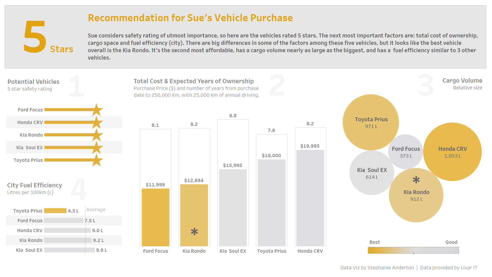

# Recommendation for Vehicle Purchase

###### Data Visualization Exercise for Lixar IT

> Stephanie Anderton
> June 2019

### Scenario

The exercise describes a story about Sue, who intends to purchase a vehicle. She has a list of ten potential vehicles and some criteria that will help her decide which to buy.

### Problem Parameters

Sue’s main criteria for deciding are, in order of importance (I assumed for 3 and 4):

1. Vehicle safety rating is of “*utmost”* importance.
2. Total cost of owning and operating the vehicle.
3. Storage space, needed for long-distance trips.
4. Fuel efficiency.

Other aspects of her car-buying decision are:

1. Sue belongs to a family of three and has a dog.
2. The car will be the family’s main mode of transportation.
3. She intends to keep the car until the odometer reads 250,000Km.
4. She also expects to drive about 25,000Km a year.

### Data

Data provided in file: `Data Visualization Exercise - Vehicle Test Data.csv`.

### Assumptions

I made a few assumptions to focus the decision making:

1. Since the safety rating is of “*utmost*” importance, I’ve decided to just look at those with a 5 star rating.
2. Operating costs for the vehicles are not included in the data, so I’m assuming this to be constant across all vehicles.
3. I’m assuming that most mileage will be driven within the city, so will only use the City Fuel efficiency figures.
4. Storage is probably quite important since she has a dog, although we don’t know how big it is.

### Process

- I arranged the elements of the visualization to basically flow from left to right across the page/screen, but placed faint numbers as a way to nudge.
- I chose the colour scheme of gold and grey to echo the stars and what gold implies. The grey is to mimic silver, the colour of metal and second place. Still “good”, but gold is “best”! 
- I based the final data visualization on the four main criteria, starting with the list in “Potential Vehicles” for safety rating. It would have been great to have 5 stars in a row for each vehicle, but that’s a rabbit hole I’ll go down another day. Looking at the image now, I think I’d try a version with a much smaller bar-star line and increase the font size for the vehicle name to bring the attention there.
- The central element of the visualization is the “Total Cost & Expected Years of Ownership”, which I thought is fitting since this is an expensive purchase. There is quite a large range in the prices, and this shows up nicely.
- I added the expected life with the vehicle (ownership) to the panel with total cost, as I thought this provided a good way to indicate the purchase cost relative to the anticipated life of the car. It would probably also be a great way to show the fuel efficiency, since the bars look like half-filled containers.
- The “Cargo Volume” looked much better as bubbles. I like to see non-linear elements in a design like curves and circles, to break the monotony of bars. In this case it also seems to echo the ‘space’ of cargo storage.
- I put the “City Fuel Efficiency” in the lower left corner, since it was 4th on the list of criteria. The line for the average gives a bit more perspective as to how near the bottom three cars are to each other.

### Data Visualization

The data visualization shown here is the PNG file.



 The version on tableau public is slightly more spread out, and doesn’t appear as well as the PNG file. <https://public.tableau.com/profile/stephanie.anderton#!/vizhome/Vehiclepurchase/Dashboard>

### Recommendation

I chose the Kia Rondo for two main reasons:

1. It’s only a little bit more expensive than the most affordable, Ford Focus.
2. The cargo space for the Kia Rondo is more than double the space in the Ford Focus. This will probably be a clincher as Sue has a dog and likes to take long distance trips and sometimes goes camping. She’ll need the space!

Despite the fact that the fuel efficiency is not as good as the Ford Focus, Sue may feel that it’s a price worth paying if she can have the kind of cargo space that the Kia Rondo offers. In the problem parameters outline, the fuel efficiency was “a factor”, while the storage space “is important”.


---

### Column Calculations

The following calculations are based on the **Kms** column from the original dataset.

#### Kms Future

```tableau
int(250000 - [Kms])
```

#### Years Owning

```tableau
[Kms Future]/25000
```

#### Ownership Years

To get an approximate date for when the vehicle would reach the 250,000 Km mark, the following column calculation was used. It is based on the previous column calculations, and from a purchase date of July 1, 2019.

```tableau
DATE(
    DATEADD(
        'year',
        FLOOR([Years Owning]),
        DATE(
            DATEADD(
                'day',
                INT(FLOAT([Years Owning]-FLOOR([Years Owning]))*365),
                #2019-07-01#
            )
        )
    )
)
```

*Note: This column, and the next, were not used in the final version of the data visualization, but I’ve left it here as some sheets in the tableau workbook still use this.*

#### Cost per Year Owned

```tableau
ROUND(FLOAT([Price]/[Years Owning]), 3)
```

