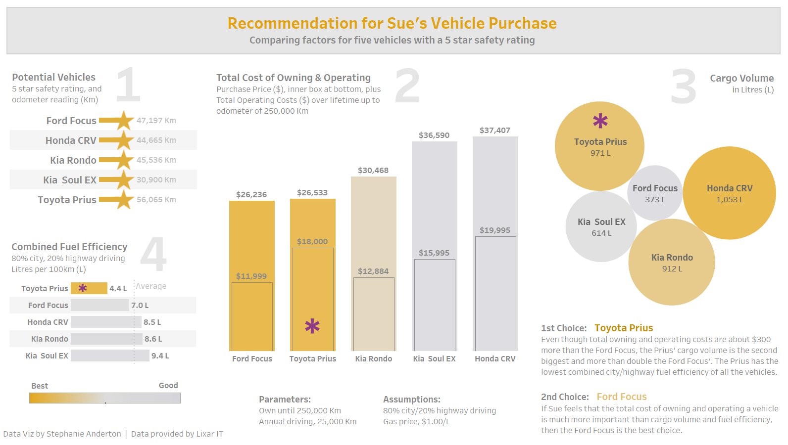
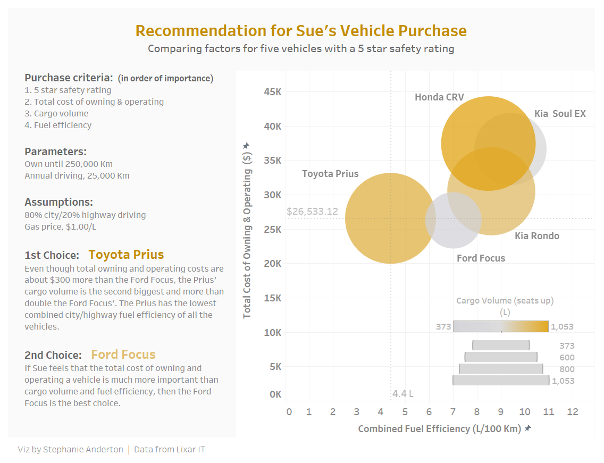

# Recommendation for Vehicle Purchase

by Stephanie Anderton  |  Revised June 14, 2019  |  _Version 2_

###### Data Visualization Exercise for Lixar IT

### Scenario

The exercise describes a story about Sue, who intends to purchase a vehicle. She has a list of ten potential vehicles and some criteria that will help her decide which to buy.

### Problem Parameters

Sue’s main criteria for deciding are, in order of importance (I assumed for 3 and 4):

1. Vehicle safety rating is of “*utmost”* importance.
2. Total cost of owning and operating the vehicle.
3. Storage space, needed for long-distance trips.
4. Fuel efficiency.

Other aspects of her car-buying decision are:

1. Sue belongs to a family of three and has a dog.
2. The car will be the family’s main mode of transportation.
3. She intends to keep the car until the odometer reads 250,000 Km.
4. She also expects to drive about 25,000 Km a year.

### Data Source

`Data Visualization Exercise - Vehicle Test Data.csv`.

### Assumptions

I made a few assumptions to focus the decision making:

1. Since the safety rating is of “*utmost*” importance, I’ve decided to look at just those with a 5 star rating.
2. Operating costs for a vehicle would include maintenance, insurance and gas. I’m going to assume that maintenance and insurance are the same for all vehicles, but will calculate the estimated annual fuel costs based on a flat gas price of \$1.00/L for simplicity.
3. I’m assuming the annual city/highway mileage will be 80/20 split:
   1. Annual city driving of 20,000 Km,
   2. Annual highway driving of 5,000 Km.
4. Storage is probably quite important since she has a dog, although we don’t know how big it is.

### Process

- I arranged the elements of the visualization to basically flow from left to right across the page/screen, but placed faint numbers as a way to nudge.
- I chose the colour scheme of gold and grey to echo the stars and what gold implies. The grey is to mimic silver, the colour of metal and second place. Still “good”, but gold is “best”! 
- I based the final data visualization on the four main criteria, starting with the list in “Potential Vehicles” for safety rating. It would have been great to have 5 stars in a row for each vehicle, but that’s a rabbit hole I’ll go down another day. I added the vehicle’s odometer reading for reference.
- The central element of the visualization is the “Total Cost of Owning & Operating”, which I thought is fitting since this is an expensive purchase. Nesting the purchase price within the bars also helps to show relative costs among the vehicles.
- I calculated the total operating costs based on the assumed annual driving, 80% city and 20% highway, and the simplistic gas price.
- The “Cargo Volume” looked much better as bubbles. I like to see non-linear elements in a design like curves and circles, to break the monotony of bars. In this case it also seems to echo the ‘space’ of cargo storage.
- I calculated the “Combined Fuel Efficiency” (FE), using 80% City FE and 20% Highway FE, and placed it in the lower left corner, since it was 4th on the list of criteria. The lines for the “Average” gives a bit more perspective.

### Data Visualization

#### Version 2

This version shows each of the criteria separately.



The version on tableau public is slightly more spread out, and doesn’t appear as nicely as the PNG file.

https://public.tableau.com/profile/stephanie.anderton#!/vizhome/Vehiclepurchase-v2/Dashboardv2

#### Version 3

I created a simplified version that shows the 4 criteria represented in a single plot.



https://public.tableau.com/profile/stephanie.anderton#!/vizhome/Vehiclepurchase-v3/Dashboardv3

### Recommendation

The **Toyota Prius** is the best overall choice according to Sue’s criteria.

1. It has a 5 star safety rating.
2. It has almost the same total cost of owning and operating as the Ford Focus, even though the purchase price is \$6K more.
3. The cargo space is almost the same as the largest, and more than double that of the Ford Focus. This was important to Sue since she has a dog and likes to take long distance trips and sometimes goes camping.
4. It has the best fuel efficiency by far.

If, however, Sue feels that the total cost of owning & operating is much more important than the cargo space and fuel efficiency, then the **Ford Focus** would be the best choice. Her savings would be negligible though, only amounting to about \$300 over the anticipated 7+ years that she would own the vehicle.


---

### New Calculated Fields

Several new columns were created for calculations that were used in the visualizations.

Here, a subset of data for **Toyota Prius**; some of the columns are used in the following calculations.

| Make   | Model | Safety Rating | Price      | Kms   | Highway Fuel Efficiency (L/100km) | City Fuel Efficiency (L/100km) | Cargo Volume (seats up) |
| ------ | ----- | ------------- | ---------- | ----- | --------------------------------- | ------------------------------ | ----------------------- |
| Toyota | Prius | 5             | $18,000.00 | 56065 | 4.8                               | 4.3                            | 971                     |

#### New Columns

| Kms Future | Years Owning | Total Op Costs | Total Lifetime Costs | Combined Fuel Efficiency | Annual Op Costs |
| ---------- | ------------ | -------------- | -------------------- | ------------------------ | --------------- |
| 193,935    | 7.75740      | 8,533.14       | 26,533.14            | 4.4                      | 1,100.00        |

#### Kms Future

```tableau
INT(250000 - [Kms])
```

$$
INT(250000 - 56065) = 193,935
$$

#### Years Owning

```tableau
[Kms Future] / 25000
```

$$
193935/25000 = 7.75740
$$

#### Total Op Costs

Assuming the annual city mileage of 20,000 Km and highway mileage of 5,000 Km, and price of gas at \$1.00/L.

```tableau
((20000 * [Years Owning] / 100) * [City Fuel Efficiency (L/100km)] * 1.00 ) +
((5000 * [Years Owning] / 100) * [Highway Fuel Efficiency (L/100km)] * 1.00 )
```

$$
((20000 * 7.75740 / 100) * 4.3 * 1.00 ) +
((5000 * 7.75740 / 100) * 4.8 * 1.00 ) = 8,533.14
$$

#### Total Lifetime Costs

```tableau
[Price] + [Total Op Costs]
```

$$
18000.00 + 8,533.14 = 26,533.14
$$

#### Combined Fuel Efficiency

```tableau
(0.80 * [City Fuel Efficiency (L/100km)]) +
(0.20 * [Highway Fuel Efficiency (L/100km)])
```

$$
(0.80 * 4.3) +
(0.20 * 4.8) = 4.4
$$

#### Annual Op Costs

```tableau
ROUND(FLOAT([Total Op Costs]/[Years Owning]), 2)
```

$$
ROUND(FLOAT(8533.14 / 7.75740), 2) = 1,100.00
$$

